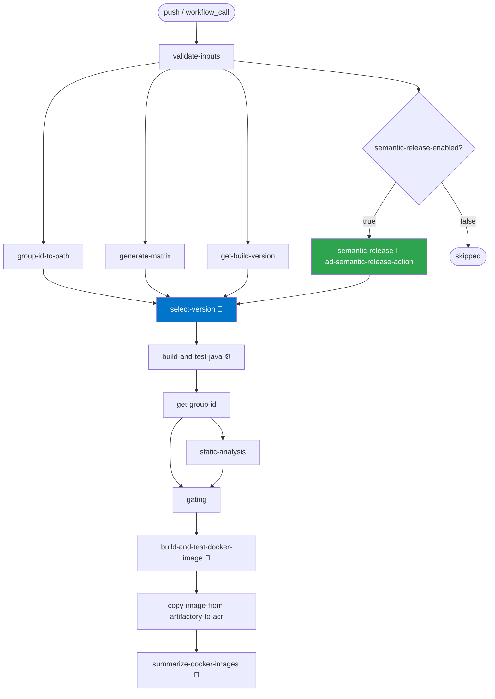
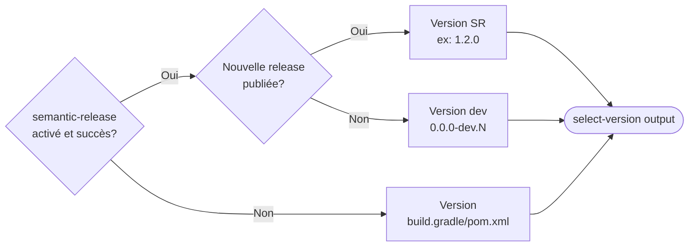

# Ad CI Java and Docker

Workflow réutilisable pour le CI/CD des projets Java et Docker chez Desjardins. Il orchestre le build, les tests, l'analyse statique, le gating, la construction Docker et le versioning automatique via Semantic Release.

## Flux d'exécution



### Sélection de version

Le job `select-version` choisit la version à utiliser selon la priorité suivante:



## Inputs

### Requis

| Input | Type | Description |
|-------|------|-------------|
| `technology` | string | Technologie de build: `maven` ou `gradle` |
| `group-id` | string | GroupId du projet Java (ex: `ad.digital.mobile`) |
| `component-name` | string | Nom du composant principal |
| `docker-labels` | string | Labels Docker à appliquer à chaque image |

### Optionnels - Build

| Input | Type | Défaut | Description |
|-------|------|--------|-------------|
| `runs-on` | string | `vars.DEFAULT_RUNNER_LABEL` | Runner GitHub Actions |
| `jdk-version` | number | `17` | Version du JDK |
| `build-output-folder-name` | string | `build-output` | Dossier de résultat du build |
| `static-analysis-output-folder-name` | string | `static-analysis-output` | Dossier de résultat de l'analyse statique |
| `gating-output-folder-name` | string | `gating-output` | Dossier de résultat du gating |

### Optionnels - Docker

| Input | Type | Défaut | Description |
|-------|------|--------|-------------|
| `artifactory-project-key` | string | `assurance-dommage` | Clé du projet Artifactory |
| `dockerfile-filename` | string | `Dockerfile` | Nom du Dockerfile |
| `docker-registry` | string | `artifacts.lc.az.nuagesdesjardins.com/assurance-dommage-docker-dev` | Registry Docker |
| `docker-copy-image-from-artifactory-to-acr` | boolean | `true` | Copier l'image vers l'ACR |
| `docker-copy-acr-repository-url` | string | `npd03cacnacrgen.azurecr.io` | URL du repository ACR |
| `trivy-enabled` | boolean | `false` | Activer le scan Trivy |
| `trivy-exit-code` | number | `0` | Code de sortie Trivy (0=ignore, 1=fail) |
| `artifactory-xray-enabled` | boolean | `false` | Activer le scan Xray |
| `checkov-enabled` | boolean | `false` | Activer le scan Checkov |
| `goss-enabled` | boolean | `false` | Activer le scan Goss |

### Optionnels - Release

| Input | Type | Défaut | Description |
|-------|------|--------|-------------|
| `release-generation` | boolean | `true` | Inclure le job de release |

### Optionnels - Semantic Release

| Input | Type | Défaut | Description |
|-------|------|--------|-------------|
| `semantic-release-enabled` | boolean | `false` | Activer Semantic Release. **Désactivé par défaut** pour ne pas impacter les projets existants. |
| `semantic-release-branches` | string | `'["main", "master"]'` | Branches sur lesquelles les releases sont générées (JSON array). Les autres branches tournent en dry-run. |

## Secrets

| Secret | Requis | Description |
|--------|--------|-------------|
| `ROLEID` | ✅ | Role ID Vault pour l'accès Artifactory |
| `SECRETID` | ✅ | Secret ID Vault pour l'accès Artifactory |

## Permissions

Le workflow requiert les permissions suivantes (à déclarer dans le workflow appelant):

```yaml
permissions:
  contents: write
  issues: write
  pull-requests: write
```

## Utilisation

### Configuration minimale (sans Semantic Release)

```yaml
name: ci-main

on:
  push:
    branches:
      - main

permissions:
  contents: write
  issues: write
  pull-requests: write

jobs:
  build:
    uses: Desjardins/ad-gha-workflows/.github/workflows/ad-ci-java-and-docker.yml@v3
    with:
      technology: gradle
      group-id: ad.digital.mobile
      component-name: mon-composant
      docker-labels: |
        PROPRIETAIRE: "email@desjardins.com"
    secrets:
      ROLEID: ${{ secrets.ROLEID }}
      SECRETID: ${{ secrets.SECRETID }}
```

### Avec Semantic Release activé

```yaml
name: ci-main

on:
  push:
    branches:
      - main

permissions:
  contents: write
  issues: write
  pull-requests: write

jobs:
  build:
    uses: Desjardins/ad-gha-workflows/.github/workflows/ad-ci-java-and-docker.yml@v3
    with:
      technology: gradle
      group-id: ad.digital.mobile
      component-name: mon-composant
      jdk-version: 21
      build-output-folder-name: build/libs
      static-analysis-output-folder-name: build/reports
      docker-labels: |
        PROPRIETAIRE: "email@desjardins.com"
      # Semantic Release
      semantic-release-enabled: true
      semantic-release-branches: '["main"]'
      release-generation: true
    secrets:
      ROLEID: ${{ secrets.ROLEID }}
      SECRETID: ${{ secrets.SECRETID }}
```

### Avec Semantic Release sur plusieurs branches

```yaml
with:
  semantic-release-enabled: true
  semantic-release-branches: '["main", "develop"]'
```

## Semantic Release

### Fonctionnement

Quand `semantic-release-enabled: true`, le workflow utilise l'action [`Desjardins/ad-semantic-release-action@v1`](https://github.com/Desjardins/ad-semantic-release-action) pour générer automatiquement:
- ✅ Une version selon les commits conventionnels
- ✅ Un tag Git (ex: `v1.2.0`)
- ✅ Une release GitHub avec notes de version
- ✅ Un `CHANGELOG.md` mis à jour
- ✅ Des liens vers les tickets Jira dans les release notes

### Convention Conventional Commits

| Type | Impact | Exemple |
|------|--------|---------|
| `fix:` | PATCH `1.0.0 → 1.0.1` | `fix: correction timeout API` |
| `feat:` | MINOR `1.0.0 → 1.1.0` | `feat: ajout export PDF` |
| `feat!:` / `BREAKING CHANGE:` | MAJOR `1.0.0 → 2.0.0` | `feat!: refonte API` |
| `docs:`, `chore:`, `refactor:`, etc. | Aucun | `docs: mise à jour README` |

### Avec tickets Jira

```bash
# Format recommandé
git commit -m "feat(INFRA-123): ajout système de cache"
git commit -m "fix(SEC-456): correction faille XSS"

# Avec description longue
git commit -m "feat(INFRA-123): ajout système de cache

Implémentation d'un cache Redis pour améliorer les performances.

Refs: INFRA-123"
```

**Résultat dans les release notes:**
```markdown
### Features
* **[INFRA-123](https://jira.desjardins.com/browse/INFRA-123)**: ajout système de cache
```

> ⚠️ **Limitation connue**: Les préfixes Jira avec underscores (ex: `DDD_SD`) ne génèrent pas de liens corrects. Utiliser des préfixes alphanumériques uniquement (ex: `DDDSD`, `INFRA`, `SEC`).

### Comportement selon les branches

| Branche | Dans `semantic-release-branches`? | Comportement |
|---------|-----------------------------------|--------------|
| `main` | ✅ | Release complète: tag + release GitHub + CHANGELOG |
| `develop` | ✅ (si configuré) | Release complète |
| `feature/*` | ❌ | Dry-run: analyse uniquement, pas de release |

### Version utilisée selon les scénarios

| Scénario | Version utilisée | Exemple |
|----------|-----------------|---------|
| SR activé + commits `feat:`/`fix:` | Version Semantic Release | `1.2.0` |
| SR activé + pas de commits pertinents | Version dev | `0.0.0-dev.42` |
| SR désactivé | Version de `build.gradle`/`pom.xml` | `1.0.0-SNAPSHOT` |
| Fallback (toutes sources en échec) | Version dev | `0.0.0-dev.42` |

## Structure des jobs

```
validate-inputs
├── group-id-to-path
├── generate-matrix
├── get-build-version
└── semantic-release (si activé)
        ↓
    select-version
        ↓
    build-and-test-java
        ↓
    get-group-id
    ├── static-analysis
    └── gating
            ↓
        build-and-test-docker-image
            ↓
        copy-image-from-artifactory-to-acr
            ↓
        summarize-docker-images
```

## Troubleshooting

### Semantic Release ne génère pas de nouvelle version

**Cause**: Aucun commit `feat:` ou `fix:` depuis le dernier tag.

**Solution**: C'est normal. La version `0.0.0-dev.N` sera utilisée. Pour générer une release, faire un commit `feat:` ou `fix:`.

### Erreur de permission sur le CHANGELOG

**Cause**: Permissions GitHub insuffisantes.

**Solution**: Vérifier que les permissions `contents: write` sont bien déclarées dans le workflow appelant.

### Version `unspecified` dans `get-build-version`

**Cause**: La version n'est pas définie dans `build.gradle`.

**Solution**: Activer Semantic Release ou définir une version dans `build.gradle`.

### Liens Jira incorrects dans les release notes

**Cause**: Le préfixe Jira contient un underscore (ex: `DDD_SD`).

**Solution**: Utiliser un préfixe sans underscore. C'est une limitation du plugin `semantic-release-jira-notes`.

## Ressources

- [ad-semantic-release-action](https://github.com/Desjardins/ad-semantic-release-action) - Action Semantic Release utilisée
- [Conventional Commits](https://www.conventionalcommits.org/) - Convention de commits
- [Semantic Versioning](https://semver.org/) - Versioning sémantique
- [emerald-reusable-workflows-java](https://github.com/Desjardins/emerald-reusable-workflows-java) - Workflows réutilisables Java
